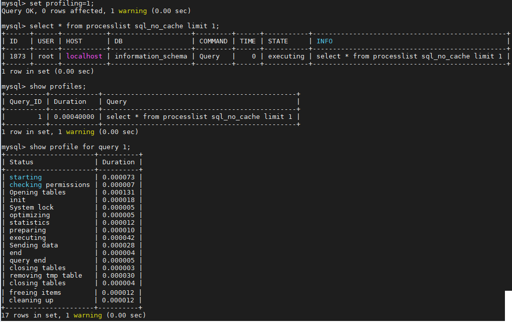

## 目录
* [CentOS中安装MySQL](#CentOS中安装MySQL)

### 番外篇
* 数据库的扩展没有web服务器那样容易
* sql查询速度，服务器硬件，网卡流量，磁盘IO，大表，大事务会对数据库性能造成影响，idle空闲时间
* max_connection默认是100，连接数超过100的话后面的请求会等待connection，如果超时就返回5XX错误
* SSK fashionIO磁盘
* 大表对DDL操作的影响
  * MySQL 5.5前，建立索引会锁表
  * MySQL 5.5后，不会缩表但会引起主从延迟
  * 修改表结构需要长时间缩表
  * 采用分库分表来拆分成多个小表
    * 分表主键的选择
    * 分表后跨分区数据的查询和统计
  * 对大表的历史数据归档-可以减少对前后端业务的影响
    * 归档时间点的选择
    * 如何进行归档操作
  * 大事务：运行时间长，操作的数据比较多的事务，例如余额宝计算用户昨天的收益，特别是理财产品买的多的情况下，回滚所需的时间长

#### MySQL体系结构
* MySQL最大的特点-插件式存储引擎，能够将数据的插入，提取相分离

#### MySQL基准测试
* 基准测试是对机器性能的测试，不同于普通的压力测试，不需要关心业务逻辑，类似redis-benchmark
  * 建立MySQL服务器的性能基准线
  * 模拟当前系统的更高负载，找出系统的瓶颈，找出QPS/TPS
* 基准测试方式
  * 从系统入口测试，例如网站入口/APP；能反映系统各个组件间性能问题，测试比较复杂
  * 单独对MySQL进行基准测试；设计简单，耗时短
* 结果统计
  * QPS：单位时间内所处理的查询数
  * TPS：单位时间内所处理的事务数
  * 响应时间：平均响应时间、最小响应时间、最大响应时间、各时间所占百分比(P95/P90)
* 基准测试常用工具
  * sysbench：跨平台，支持多线程，多种数据库，较为通用
  * mysqlslap: mysql自带的

#### 数据库结构优化
* 目的
  * 尽量减少数据冗余
  * 尽量避免数据维护中出现更新、插入和删除异常
  * 节约数据存储空间
  * 提高查询效率
* 需求分析
  * 存储需求
  * 数据处理需求
  * 数据安全性和完整性
* 数据库设计范式
  * 设计出没有数据冗余和数据维护异常的数据库结构
  * 第一范式：字段不可分
  * 第二范式：行数据有主键，非主键字段依赖主键
  * 第三范式：行数据中非主键字段不能相互依赖，没有传递依赖（例如id, name, zip, province, city）,其中province,city -> zip， zip -> id
* 字段数据类型选取
  * 原则：当一个列可以选择多种数据类型时，应该优先考虑数字类型，其次是日期或二进制类型，最后是字符类型。对于相同级别的数据类型，应该优先选择占用空间小的数据类型。Innodb一列的最大大小是16K，当列越小，加载需要的宽度越少，加载越快。
  * 整数类型

  | 列类型 | 存储空间 | Signed无符号 | Unsigned有符号 |
  |:-------|:--------|:-------------|:--------------|
  | tinyint | 1字节 | -128 ~ 127 | 0 ~ 255 |
  | smallint | 2字节 | -2^15 ~ 2^15 - 1 | 0 ~ 2^16|
  | mediumint | 3字节 | -2^23 ~ 2^23 - 1 | 0 ~ 2^24|
  | int | 4字节 | -2^31 ~ 2^31 - 1 | 0 ~ 2^32|
  | bigint | 8字节 | -2^63 ~ 2^63 - 1 | 0 ~ 2^64|

  * float:会丢失精度，在进行一些汇总的时候数据往往不正确
  * double：比float精度高，也是非精确类型
  * decimal：进度更高，是精确类型，存储空间要大一些
    * DECIMAL从MySQL 5.1引入，列的声明语法是DECIMAL(M,D)。在MySQL 5.1中，参量的取值范围如下：
    * M是数字的最大数（精度）。其范围为1～65（在较旧的MySQL版本中，允许的范围是1～254），M 的默认值是10。
    * D是小数点右侧数字的数目（标度）。其范围是0～30，但不得超过M。
    * 说明：float占4个字节，double占8个字节，decimail(M,D)占M+2个字节。
    * 如DECIMAL(5,2) 的最大值为9 9 9 9 . 9 9，因为有7 个字节可用。
  * varchar：存储变长字符串，以字符为单位；列的最小宽度小于255则占用一个额外字节，大于255则暂用两个额外的字节；varchar的最大宽度65535，由innodb数据引擎决定。使用时结合业务使用最小的符合需求的长度。如果后面改列宽度，要是依旧小于255，不锁表，否则锁表。查询时，内存会根据类型固定查询列的长度，如果列设置过大或不合理，就造成了内存浪费。
  * char：存储定长的字符串，最大宽度255。char中如果存储的字符串末尾有空格，则会被自动删除掉，而varchar不会的哦。md5值适合使用char，身份证号啊。char适合存储经常被更新的值，因为Mysql会很方便的准备好列的宽度，而varchar不行。
  * 日期类型
    * datatime：占用8个存储空间，存储范围大。默认 YYYY-MM-DD HH:MM:SS，默认保持秒，也可以保留微秒，datatime同时区无关。
    * timestamp：存储的时间戳，从格林尼治时间1970年1月1日到当前时间的秒数，占4个字节，只能保存1970-01-01到2038-01-19。显示的值依赖于所指定的时区。在表中指定任何一个timestamp列的值，当行数据修改时自动修改timestamp列的值，可以来标识最后修改时间，默认第一个timestamp列的值会自动更新，当然也可以指定哪一列自动更新。
    * date: 存储用户生日的时候，占3个字节
    * time：存储时间部分

#### MySQL的复制功能
* MySQL的复制是基于二进制日志增量进行的，会导致备库与主库存在数据不一致的问题
* 复制解决了什么问题
  * 实现在不同服务器上的数据分布
  * 实现数据读取的负载均衡
    * 需要其他组件配合完成，利用DNS轮询的方式把程序的读连接到不同的备份数据库，利用LVS，haproxy这样的代理方式
* 复制
  * 基于SQL语句的复制
    * 二进制日志格式使用的是statement
  * 基于行的复制
    * 二进制日志格式使用的是基于行的日志格式

#### MySQL日志
* MySQL服务层日志
  * 二进制日志/慢查询日志/通用日志
    * 二进制日志：记录了所有对mysql数据库的修改事件，包括增删改查事件和对表结构的修改事件。有个binlog的工具
    * 二进制日志格式
      * 基于段的格式 binlog_format=STATEMENT，日志量相对较小，节约磁盘和网络i/o
      * 基于行的格式 默认格式，binlog_format=ROW。假设一SQL语句修改了1W天数据的情况下，基于段的日志只会记录这个SQL语句，基于行的日志会有1W条记录分别记录每一行的数据修改，可以避免主从复制不一致的的情况。binlog_row_image不同配置参数会导致日志量过大 ，建议设置成minimal，由mysql决定使用段还是行
* MySQL存储引擎层日志
  * innodb中的重做日志/回滚日志

#### 索引
* 作用：告诉存储引擎怎么快速的找到数据，索引是在存储引擎层实现的 - 以空间换时间
* MySQL索引类型
  * B-tree:以B+树的结构存储数据
    * 可以使用到B树索引的：
      * 全值匹配的查询： order_sn = '92322'
      * 匹配最左前缀的查询: （order_sn, order_date）联合索引，中第一列可以用到索引
      * 匹配列前缀查询：可以匹配列的前缀， order_sn like '92%'
      * 范围查找：order_sn > ? and order_sn < ?
      * not in和<>操作无法使用索引
      * 如果查询中有某个列的范围查询，则其右边所有列都无法使用索引
  * Hash索引：Hash索引是基于Hash表实现的，只有查询的条件精确匹配Hash索引中的所有列时，才能使用到Hash索引，也就是等值查询。存储引擎会为每一行计算一个Hash码，Hash索引中存储的就是Hash码，索引中没有保存行列的值，因此需要两次读取，第一次找到hash码，第二次根据hash码中的位置找到数据。Hash索引无法用于排序，同时可能存在Hash冲突
* 使用索引优缺点
  * 优点
    * 索引大大减少了存储引擎需要扫描的数据量
    * 索引可以帮助我们进行排序以避免使用临时表
    * 索引可以把随机IO变为顺序IO
  * 缺点
    * 索引会增加写操作的成本
    * 太多的索引会增加查询优化器的选择时间
* 索引优化策略
  * 索引列上不能使用表达式或者函数，即使使用了存储引擎也不会使用这个索引，这时索引就没有意义了
  * 选择索引列的顺序
    * 经常会被使用的列优先
    * 选择性高的列优先
    * 宽度小的列优先
  * 覆盖索引
    * 可以优化缓存，减少磁盘IO操作
    * 可以减少随机IO，变随机IO操作为顺序IO操作
    * 可以避免对Innodb主键索引的二次查询
    * 不能使用双%号的like查询
  * mysql允许在同一列创建多个索引
  * 建立了主键索引，就没必要再建立唯一索引了，因为主键索引就是一个非空的唯一索引
    * 检测和删除重复/冗余的索引 pt-duplicate-key-checker h=127.0.0.1
  * 查找未被使用过的索引，可以通过如下SQL查找，如果read和fetch都为0的话，那就是未被使用过的
    ```sql
    select object_type,object_schema,object_name,index_name,count_star,count_read,COUNT_FETCH from performance_schema.table_io_waits_summary_by_index_usage;
    ```
  * 更新索引统计信息及减少索引碎片
    * analyze table table_name / optimize table table_name

#### SQL查询优化
* 如何获取
  * 终端用户反馈存在性能的SQL
  * 通过慢查询日志获取存在性能问题的SQL
    * 慢查询日志性能开销低，主要在IO和磁盘上
    * show_query_log 启动停止记录慢查询日志，设置为on,这是个动态的参数
    * show_query_log_file 指定慢查询日志的存储路径及文件，默认和日志存储在一起，建议分开
    * long_query_time 单位是秒，可以设置为微秒，带小数，超过设置阀值的SQL就会被记录到慢查询中，默认为10秒
    * log_queries_not_using_indexes 是否记录未使用索引的SQL
  * 实时获取存在性能问题的SQL
    * information_schema.PROCESSLIST表
      * select * from processlist where time>=?;
* 常用的慢查询日志分析工具（mysqldumpslow）
  * mysqldumpslow -s r -t 10s slow-mysql.log 猜测这个工具是从日志中过滤数据，类似linux命令
  * pt-query-digest工具
* 查询慢的原因
  * 步骤
    * 1. 客户端发送SQL请求给服务器
    * 2. 服务器检查是否可以在查询缓存中命中该SQL
      * query_cache_type 设置查询缓存是否可用
      * query_cache_size 设置查询缓存的内存大小
      * query_cache_limit 设置查询缓存可用存储的最大值，缓存太大就不会存储了，如果预先知道查询结果大，就加上SQL_NO_CACHE来提高效率
      * query_cache_wlock_invalidate 如果某个表被锁住了，是否返回缓存中的数据，默认是关闭的
      * query_cache_min_res_unit 设置查询缓存分配的内存块的最小单位
      * > 读写比较频繁的话建议关闭缓存同时设置cache size为0
    * 3. 服务器进行SQL解析，预处理，再由优化器生成对应的执行计划
      * SQL解析
        * 对SQL语句进行解析，并生成一颗对应的“解析树”，也会对SQL语句进行校验，看参数是否正确等
      * 优化
        * 重新定义表的关联顺序
        * 将外连接转换为内连接
        * 使用等价变换规则（a=5 && a>5 -> a>=5）
        * 优化count(), min()和max()
        * 提前终止查询，如果碰到某个不符合条件
    * 4. 跟踪执行计划，调用存储引擎API来查询数据，有时需要在内存中过滤数据
    * 5. 将结果返回给客户端
* 确定查询处理各阶段所消耗的时间
  * 使用profile
    * set profilling=1，启动profiling，这是一个session级别的设置，使用show profiles查看每一个查询所消耗的时间，show profile for query N, n是上一个query的id

    

### 常用命令
```sql
show variables like '%isolation' --查看数据库事务隔离级别的设置
show variables like 'binlog_format' --查看二进制日志格式
show create table tablename\G --显示表结构
select object_type,object_schema,object_name,index_name,count_star,count_read,COUNT_FETCH from performance_schema.table_io_waits_summary_by_index_usage --查找未被使用的索引

```

### 注意点
* 最好不要在主库上做数据库备份，大型活动前取消这类计划
* 如何为innodb选择主键
  * 主键应该尽可能的小，主键应该是顺序增长的（提升数据的插入效率）

### CentOS中安装MySQL
* 查看官方文档 https://dev.mysql.com/doc/mysql-yum-repo-quick-guide/en/
* 下载MySQL yum包 http://dev.mysql.com/downloads/repo/yum/（要查看系统的版本 uname -a）
* 下载yum包 wget http://repo.mysql.com/mysql57-community-release-el7-10.noarch.rpm
* 安装软件源 rpm -Uvh platform-and-version-specific-package-name.rpm
* 安装mysql服务端  yum install  -y  mysql-community-server
* 启动myssql service mysqld start

> 注意
* 首次启动后要及时登陆并修改密码
* 使用 `grep 'temporary password' /var/log/mysqld.log` 获取临时密码
* `mysql -uroot -p`输入密码登陆
* 修改全局参数
    * `set global validate_password_policy=0;`
    * `set global validate_password_length=1;`
* 修改密码 `ALTER USER 'root'@'localhost' IDENTIFIED BY 'xxxxxx';
* 开启远程连接
    `Grant all privileges on *.* to 'root'@'%' identified by 'yourpassword' with grant option;`
    `flush privileges;`

### 查看MySql数据库物理文件存放位置
* mysql> show global variables like "%datadir%"
    * Windows中一般存储在C：\ProgramData\MySQL Server 5.6\Data\
    * Linux中在/var/lib/mysql/
* 同理，可以显示全部的全局变量
    * show global variables;

### Mysql执行sql文件
* 进入mysql安装目录，找到mysql.exe所在文件夹
```
mysql -uroot -p123456 -Ddbname<C:\a.sql
```
* 进入mysql command
```
source C:\a.sql
```