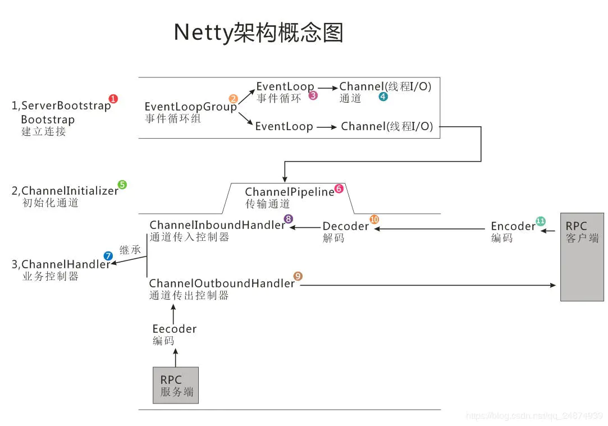

# 目录

## 学习计划
`入门阶段`
* Netty 简单server和client示例 https://www.jianshu.com/p/3c0830e13467
* 基于netty搭建websocket，实现消息的主动推送 https://www.jianshu.com/p/56216d1052d7
* Netty实现简单HTTP代理服务器 https://www.cnblogs.com/w1570631036/p/9665385.html
* Netty总结+实现一个简易版Tomcat https://www.cnblogs.com/wuzhenzhao/p/10418650.html
* Netty Channel Option详解 https://www.ezlippi.com/blog/2019/05/netty-channel-option.html
* Netty源码分析 https://segmentfault.com/a/1190000007282628
* Netty之微信-IM介绍
    * 代码地址 https://github.com/peiguihuang/wechat-netty
    * 文档说明介绍
        * https://www.jianshu.com/p/7522bda72a25
        * https://blog.csdn.net/huangpeigui/article/details/86596245
* webSocket进阶篇——STOMP Over Websocket https://www.jianshu.com/p/32fae52c61f6
* Netty 粘包/半包原理与拆包实战 https://blog.csdn.net/crazymakercircle/article/details/83957259
* 如何用JAVA实现一款高可用的TCP数据传输服务器(一)——【基于netty4.x】 https://blog.csdn.net/qq_24874939/article/details/86475285 https://github.com/Siwash/netty_TCP
* Linux下Netty实现高性能UDP服务(SO_REUSEPORT) https://www.jianshu.com/p/61df929aa98b
`深入学习`
* BIO/NIO/AIO/异步/同步
* Reactor模式/Proactor模式
* 基于Netty实现简单的RPC
* Netty NioEventGroup的单线程/多线程/主从线程模型

## Netty总结
Netty 是一款提供异步的、事件驱动的网络应用程序框架和工具，用以快速开发高性能、高可靠性的网络服务器和客户端程序。也就是说，Netty 是一个基于 NIO 的客户、服务器端编程框架，使用 Netty 可以确保你快速和简单地开发出一个网络应用。
Netty 基本上是作为架构的技术底层而存在的，主要完成高性能的网络通信。
Channel 是对Java 底层Socket 连接的抽象
ByteBuf 是Netty 整个结构里面最为底层的模块，主要负责把数据从底层IO 里面读到ByteBuf，然后传递给应用程序，应用程序处理完成之后再把数据封装成ByteBuf 写回到IO。

## Netty与Tomcat区别
* tomcat就是针对http层的，要求实现servlet规范，所以我建议http还是选择tomcat(或者其他成熟的http-server)，并不是说netty不好，而是你的选择问题。
* netty是一个网络组件，tcp,udp,http都可以弄，但是官方文档都是些hello wolrd级别的。如果你非常了解http结构，完全可以基于netty搞出一个比tomcat牛的http server。如果做tcp开发，netty不二之选！
Netty是基于Java NIO开发的，而Tomcat是Apache下的针对HTTP的服务器项目，前者更像一个中间件框架，后者更像一个工具

# 引用
* [netty与tomcat区别](https://blog.csdn.net/fqwgc8/article/details/50291781)
* [tomcat 源码为啥不采用netty 处理并发？](https://www.zhihu.com/question/53498767)
* [tomcat对keep-alive的实现逻辑](http://hongjiang.info/how-tomcat-implements-keep-alive/)