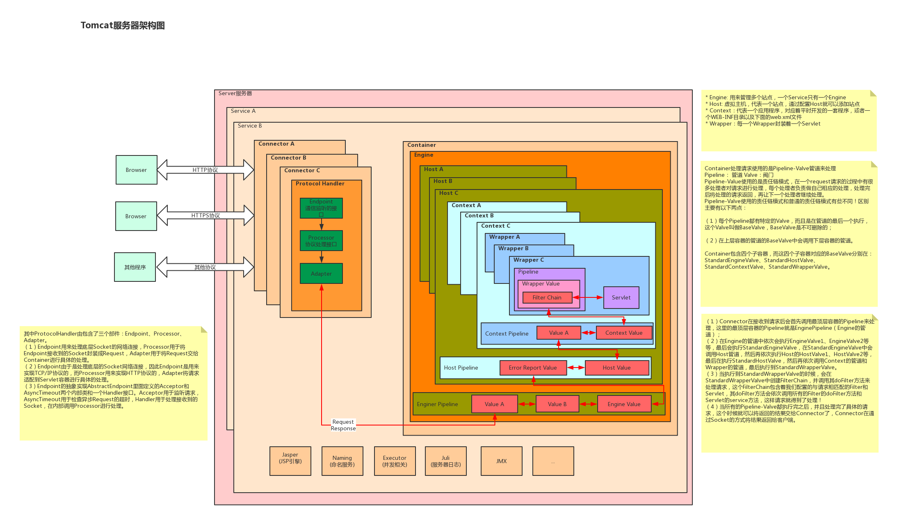

<center>

### 一张图了解Tomcat架构

</center>



* Server
    ```
    Server是Tomcat的最顶层结构，包含多个service，server控制着整个Tomcat的生命周期。
    ```

    * Service
        ```
        一个Service由多个Connector和一个Container组成，形成一个独立完整的处理单元，负责对外提供服务。一般情况下，我们只需要配置一个service就可以，tomcat默认配置了Cataline这个service（conf/server.xml <Service name="catalina">）
        ```
        * Connector:
            ```
            Connector负责把接收到的请求解析出来然后封装成request和response对象，然后交给Container处理。
            ```
        * Container:
            ```
            一个Service只有一个Container
            ```
            * Engine
                ```
                一个Container只有一个Engine，代表了一个完整的Servlet引擎，它接收来自Connector的请求，并决定传给哪个Host来处理，Host处理完请求后，将结果返回给Engine，Engine再将结果返回给Connector。
                ```
                * Host
                    ```
                    一个Engine可以包含多个Host，每个Host代表一个虚拟主机，这个虚拟主机的作用就是运行多个应用，它负责安装和展开这些应用，并且标识这个应用以便能够区分它们，每个虚拟机对应了一个域名，不同Host容器接收处理对应的域名的请求
                    ```
                    ```

                    ```
                    * Context
                        ```
                        Host可以包含多个Context，Context是Servlet规范的实现，它提供了Servlet的基本环境，一个Context代表一个运行在Host上的Web应用
                        ```
                        * Wrapper
                            ```
                            Context可以包含多个Wrapper, Wrapper 代表一个 Servlet，它负责管理一个 Servlet，包括的 Servlet 的装载、初始化、执行以及资源回收。Wrapper 是最底层的容器，它没有子容器了，所以调用它的 addChild 将会报错。
                            ```
        * Loging:
            ```
            当一个容器里面装了logger组件后， 这个容器里所发生的事情， 就被该组件记录下来, 我们通常会在logs/ 这个目录下看见catalina_log.time.txt 以及localhost.time.txt和localhost_examples_log.time.txt。 这就是因为我们分别为：engin, host以及context(examples)这三个容器安装了logger组件， 这也是默认安装， 又叫做标配
            ```
        * Loader:
            ```
            loader这个组件通常只会给我们的context容器使用，loader是用来启动context以及管理这个context的classloader用的
            ```
        * pipline:
            ```
            pipeline是这样一个东西，使用的责任链模式.  当一个容器决定了要把从上级传递过来的需求交给子容器的时候， 他就把这个需求放进容器的管道(pipeline)里面去。 而需求傻呼呼得在管道里面流动的时候， 就会被管道里面的各个阀门拦截下来。 比如管道里面放了两个阀门。 第一个阀门叫做“access_allow_vavle”， 也就是说需求流过来的时候，它会看这个需求是哪个IP过来的， 如果这个IP已经在黑名单里面了，sure, 杀！ 第二个阀门叫做“defaul_access_valve”它会做例行的检查， 如果通过的话，OK， 把需求传递给当前容器的子容器。 就是通过这种方式， 需求就在各个容器里面传递，流动， 最后抵达目的地的了。
            ```
        * valve:
            ```
            就是上面所说的阀门。
            ```


### 知识点总结
* Standard*XXXX*是组件接口的默认实现类。
* 如果希望定制Web应用的错误页面，出了按照Servlet规范在web.xml中添加<error-page>外，还可以通过配置Host中的errorReportValueClass属性来实现。前者的作用范围是当前web应用，后者是整个虚拟机。除非错误页面和具体web应用无关，否则不推荐使用此配置方式，当然此配置方式的另一个好处是处于安全的考虑，隐藏了服务器的细节。

### Tomcat Server处理一个HTTP请求过程
1. 用户点击页面，用户请求（localhost/test/index.jsp）被发送到本机端口的8080，被在那里监听的HTTP/1.1 Connector捕获
2. Connector把请求（Socket请求）封装成request和response，交给Container
3. Container中Engine获得请求localhost/test/index.jsp，匹配所有的虚拟主机Host
4. 名为localhost的Engine获得请求/test/index.jsp，匹配她所拥有的所有Context。Host匹配到路径为/test的Context
5. /test的Contxt获得/index.jsp，在其所有的wrapper中找到对应的servlet
6. servlet调用JspServlet中的doGet()或doPost()等执行业务逻辑
7. Context把执行完之后的HttpServletResponse对象返回给Host
8. Host返回给Engine，Engine返回给Connector，connector返回给Browser

* 如果要去掉默认该界面，可以重命名tomcat目录下的ROOT，并新建空文件夹命名为ROOT：

不错的文章： http://note.youdao.com/noteshare?id=a9d957049757af03d2823a22daf71169